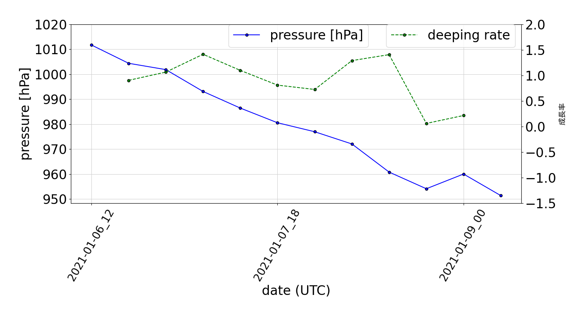

# INDEX
- [EXAMPLE](#EXAMPLE)
- [ABOUT](#ABOUT)
- [HOWTOUSE](#HOWTOUSE)
- [ENVIRONMENT](#ENVIRONMENT)
- [INSTALATION](#INSTALATION)
- [ANARYZINGTOOL](#ANARYZINGTOOL)

# EXAMPLE



# ABOUT
- 低気圧の中心をトラックするスクリプト。
- このプログラムは[爆弾低気圧データベース](http://fujin.geo.kyushu-u.ac.jp/meteorol_bomb/algorithm/index.php)と[pytrack](https://github.com/tenomoto/pytrack)を参考にして作成しました。
- 出力データはcsv形式です。

## Algorithm
1. 天気図から爆弾低気圧となる低気圧が発生した位置を目視で定め，仮の低気圧発生位置に設定してアルゴリズムをスタートする。
2. 最小値フィルタを使って東経120度から180度，北緯20度から60度の範囲で低圧部を抽出する。小規模な低圧部を除外するため，低気圧の条件として周囲と比べて0.5 hPa以上気圧が低いを定め，これを満たすものを低気圧とした。
3. 抽出した低気圧と，仮の低気圧発生場所の距離を求める。この距離が最も近いものを仮の爆弾低気圧発生場所とし，値を更新する。球面上の2点間の距離は大円距離を用いて計算する。
4. 仮の低気圧の発生位置を元に時間を巻き戻す方向に低圧部を探索する。これを低圧部が低気圧の条件を満たさなくなるまで繰り返すことで低気圧の発生時刻を特定する。また，初期の低気圧はあまり大幅な移動をおこなわないため，見つけた低圧部が6時間の間に前の位置から300 km移動していた場合は別の低気圧であると判断する。
5. 求めた爆弾低気圧の発生位置と発生時刻から爆弾低気圧のトラッキングを行う。次の時刻の低気圧の座標は同様にして，最小値フィルタによって抽出した低圧部の中うち，低気圧の条件を満たしつつ，大円距離を使って前回の低気圧の座標から最も近いものを次の時刻の低気圧の座標とする。また，求めた低気圧の座標と中心気圧は2次の双2次補間によって格子点空間を内挿する。

## Data
netcdf形式の解析データはこちらからダウンロードできます。[GPV](http://database.rish.kyoto-u.ac.jp/arch/glob-atmos/) or [JRA-55](https://auth.diasjp.net/cas/login?service=https%3A%2F%2Fdata.diasjp.net%2Fdl%2Fstorages%2Ffilelist%2Fdataset%3A204%2Flang%3Aja)
******


# HOWTOUSE
## データを格納するディレクトリ例

```shell
ls ~/data_ini/prmsl
surface-2020-12-01_00-prmsl_hPa
surface-2020-12-01_06-prmsl_hPa
surface-2020-12-01_12-prmsl_hPa
surface-2020-12-01_18-prmsl_hPa
surface-2020-12-02_00-prmsl_hPa
surface-2020-12-02_06-prmsl_hPa
surface-2020-12-02_12-prmsl_hPa
surface-2020-12-02_18-prmsl_hPa
surface-2020-12-03_00-prmsl_hPa
surface-2020-12-03_06-prmsl_hPa
```

## run

```shell
python3 -m cyclonetrack -x 135 -y 37 --dir ~/data_ini/prmsl -t 2021-01-06_12 --filetype GPV
python3 -m cyclonetrack -x 135 -y 37 --dir ~/jra55/anl_surf125/202101 -t 2021-01-06_12 --filetype jra55
```
******


# INSTALATION
## install library

```shell
pip install -r requirements.txt
```

## build(しなくてもよい)

### build from source cord.

```shell
git clone https://github.com/RyosukeDTomita/cyclone_track.git
cd cyclone_track
python3 setup.py install
```

### build from tar.gz(sometime flozen file is not up to date.)

```shell
wget https://github.com/RyosukeDTomita/cyclone_track/blob/master/dist/cyclone-track-0.0.1.tar.gz
pip install cyclone-track-0.0.1.tar.gz
```

make cyclone-track-0.0.1.tar.gz

```shell
git clone https://github.com/RyosukeDTomita/cyclone_track.git
cd cyclone_track
python3 setup.py sdist
pip install ./dist/cyclone-track-0.0.1.tar.gz
```

## uninstall

```shell
python setup.py develop -u
pip uninstall cycloen-track
```
******


# ENVIRONMENT
- Python3.8
- Ubuntu 20.04 LTS
******


# ANARYZINGTOOL
解析に用いたコードは[analyze_tool/](./analyze_tool)に格納されている。詳しくは，[こちら](analyze_tool/README.md)


# OTHER PROGRAM
[Calcureate Local Deeping Rate](https://github.com/RyosukeDTomita/cyclone_ldr)
